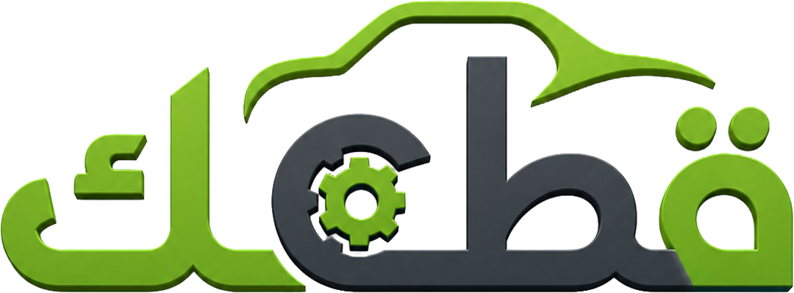

 

# Qitak

**The used car parts marketplace for Algeria**

---

## The Problem

Finding used car parts in Algeria still means WhatsApp groups, driving between scrapyards, and hoping the seller is honest. There is no trusted platform, no reference pricing, no accountability.

## The Solution

**Qitak** (قطعك — *"your parts"* in Algerian Arabic) connects buyers with identity-verified sellers on a single structured marketplace — precise vehicle-matched search, direct in-app messaging, and a full deal lifecycle from request to rating.

---

## How It Works

1. **Search** — Filter by vehicle make, model, year, and wilaya
2. **Connect** — Message the seller directly inside the app
3. **Close the deal** — Request, receive, and rate

---

## Why Qitak?

- **Verified sellers** — Every seller is reviewed and identity-confirmed before listing
- **Real ratings** — Both buyer and seller are rated after every deal
- **Fitment-matched search** — Results scoped to your exact vehicle, not the whole catalogue
- **Real-time alerts** — Instant notifications for messages and deal updates
- **Arabic · French · English** — Full localization for Algeria's three languages

---

## Who It's For

| Who | What they get |
|---|---|
| **Buyers** | Browse, compare, and purchase with confidence |
| **Sellers** | List your inventory and manage your deal pipeline in one place |

---

## Availability

iOS and Android — Algeria.

---

© 2026 Qitak — All rights reserved.

This software is proprietary and confidential. Copying, distribution, or modification without explicit written permission from the owner is strictly prohibited.

